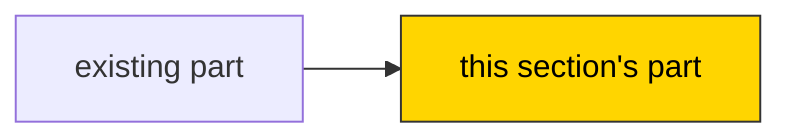

# Booklet format

The renderer (`scripts/render_booklet.py`) and the companion workflow both rely on these conventions:

- `# ` (H1) is the file's title. Exactly one per file.
- Every `## ` (H2) starts a new **page** in the HTML view. Use H3 or lower inside a page.
- A step heading is `## Step <section>.<n>: <title>`, for example `## Step 2.3: Load levels from JSON`.
- A step's progress is the first task checkbox under its heading: `- [ ] Done` or `- [x] Done`.
- The recap heading is `## Recap: <title>`. Until the section is finished, its body is the single line `_Written when you finish this section._`
- Section files are named `section-NN-<slug>.md`. They exist only for sections whose steps are written. Upcoming sections without written steps are rows in the cover table only.
- The cover's `## The sections` table lists **every** section. The renderer uses it to show outlined sections that have no file yet. Keep its first column a plain number.
- A design or prototype section has `> **Type:** design` (or `prototype`) as a line in its header blockquote, and `(design)` / `(prototype)` after its name in the cover table. The viewer styles it as a blueprint.
- Hints are `<details>` blocks (they render collapsed in both GitHub and the viewer). Keep a blank line after `<summary>…</summary>` and before `</details>` so the Markdown inside renders.
- Diagrams are fenced ` ```mermaid ` blocks. Keep them small: 4–10 nodes. Use `classDef new` to highlight this section's parts.

User-facing words: Preview, Parts & tools, Done for you, Section, Step, Recap, Try it. Don't use LEGO/IKEA product terms (bag, box art, set, Allen key, sub-assembly).

Contents:
1. cover.md template
2. Section file template
3. Recap template
4. Design section and prototype section
5. Feature booklet cover differences
6. booklet/README.md

---

## 1. cover.md

Keep it readable in two or three minutes. The preview gets the space; the rest is short.

```markdown
# <Project name>

> <One-line hook that states the objective, naming the actual thing rather than a category, in words that make the builder want it. E.g. "Build a Wordle clone while learning how Svelte turns state into a screen", not "Build a small word game…".>

<One or two sentences on what that thing is and what it does. If it's based on something real that needs more context, end with a link to a page online that explains it (e.g. its Wikipedia article). If it's an original idea, describe it in its own terms; there's nothing to link.>

<One to three sentences on the tech: what kind of app it is (web app, CLI, …), the main tools, and the job each does in this project, in plain words. An overview only; Parts & tools has a line per tool.>

## Preview

<2–4 sentences describing the finished thing in use: what you do, what you see.>

<One picture: an ASCII mock of the screen/UI, a sample terminal session, or a sample output. Make it concrete, using realistic data rather than "foo".>

<Optional: one Mermaid diagram of the main pieces.>

## Parts & tools

**You'll use:**
- **<Tool>:** <what it is, and what it does in this project>. One short line for tools the builder knows; a sentence more for new ones, marked *(new to you)*.

**New to you:**
- **<Concept>** (Section N): <one line>

**Done for you:** <config, CI, boilerplate, …>. Want to do one yourself? Just say so.

## The sections

| # | Section | You'll have | Status |
| --- | --- | --- | --- |
| 1 | <Name> | <one line: the runnable/visible result> | In Progress |
| 2 | <Name> | ... | Upcoming |
| 3 | <Name> (design) | <the decision doc> | Upcoming |
| 4 | <Name> | ... | Upcoming · after 3 |

For more than about 8 sections, split the table under `### <Phase name>` headings inside `## The sections`, one table per phase, keeping the same columns and continuous numbering. The viewer shows these phases as labels in the sidebar.

Status is one of **Done**, **In Progress** (the first unfinished section) or **Upcoming**. Add `· after N` to an upcoming section that waits on a design decision.

## How to build with me

Work through a section's steps on your own. Each step has a **Check** you can confirm yourself; tick "I've done this" in `booklet/view.html` and keep going. At the end of the section, paste the **Tell your assistant** prompt into your coding assistant:
- `check section 1`: I review every step, tick them off, and write your recap
- `next`: show your next step
- `hint 1.2`: the next hint for a step (nudge → approach → key code)
- `check 1.2`: optional spot check on a single step when you're unsure
- Changed your mind about something? Just tell me, and I'll re-plan.

## Builder notes

- **Knows well:** <…>
- **New to:** <…>
- **Wants to learn:** <…>
- **Step size:** 10–20 min.

## Changelog

- <YYYY-MM-DD>: Booklet created.
```

Optional cover sections, placed between Preview and Parts & tools:

```markdown
## Already built

<Only for existing projects. What works today in 3–6 bullets, with paths. Plus anything shaky worth fixing first, one line each. Link to an existing audit/plan instead of restating it, but only if it's inside the repo; otherwise name it in plain text.>

## Design ownership

<Only for projects with open design questions.>

| Area | Owner | Where it lives |
| --- | --- | --- |
| <Game rules> | You design (Section 3) | `docs/design/rules.md` |
| <Data model> | I design: awaiting your sign-off | `docs/design/data.md` |
| <UI look> | We design: options in Section 5 | |
```

---

## 2. Section file: `section-NN-<slug>.md`

```markdown
# Section <N>: <Name>

> **You'll have:** <the runnable/visible result, concretely>
> **Steps:** <count> · about <total> min
> **New:** <concepts/APIs introduced in this section, or "nothing new: practice">

<2–3 sentences: why this section comes now, and how it connects to what's already built.>



## Step <N>.1: <Verb-first title>

- [ ] Done

**Build:** <What and why, 1–3 sentences.>

**Where:**

```text
src/
  loader.ts      ← new
  main.ts        ← changed
```

**Check:** <Concrete observation: command + expected result.>

<details>
<summary>Hint 1: nudge</summary>

<A pointer, concept or question.>

</details>

<details>
<summary>Hint 2: approach</summary>

<The plan in plain language, including the gotcha.>

</details>

<details>
<summary>Hint 3: key code</summary>

```ts
// the tricky lines only, or an analogous example
```

</details>

## Step <N>.2: …

…

## Recap: <Name>

_Written when you finish this section._
```

Optional per-step extras, used sparingly:
- `**Build it alone first:**` when a step builds a piece in isolation (a pure function plus its test) before it gets wired in later.
- `**Try it:**` a moment to stop and look: run the app and try one specific thing.
- `**Watch out:**` a known trap in one line (better placed in hint 2 unless it would silently break something).

Don't write a "Tell your assistant" line in the Markdown. The viewer adds it to each step automatically.

---

## 3. Recap

Replace the `_Written when you finish this section._` line, keeping the `## Recap: …` heading:

```markdown
## Recap: <Name>

**You built:** <1–2 sentences, concrete, using names from their actual code.>

```mermaid
flowchart LR
  %% the whole project so far, with this section's parts highlighted
  classDef new fill:#ffd500,stroke:#333,color:#000
```

**How it fits:** <How this section connects to earlier ones and what the next sections attach to.>

**What you learned:**
- <Concept>: <one line, tied to where it appears in their code>

**Try it:** <one or two specific things to try now that it works.>

**Nice touches:** <optional: something they did beyond or differently from the plan, called out specifically.>

**Next up:** Section <N+1>: <Name>. <One-line teaser.>
```

---

## 4. Design section and prototype section

Same file structure as a build section. The differences:

```markdown
# Section <N>: Design <area>

> **Type:** design
> **You'll have:** `docs/design/<area>.md`, your decisions on <…>
> **Steps:** <count> · about <total> min
> **Unlocks:** Section <X>, Section <Y>

<Why this decision comes now and what it shapes.>

## Step <N>.1: <Verb-first title, e.g. "Collect three references you like">

- [ ] Done

**Think about:** <the question(s) this step answers, and why they matter for the build>

**Produce:** <the observable output: a list in the doc, a sketch, a chosen option>

<details>
<summary>Hint 1: nudge</summary>

<A question to ask yourself.>

</details>

<details>
<summary>Hint 2: approach</summary>

<A way to break the decision down, with criteria to judge options.>

</details>

<details>
<summary>Hint 3: examples</summary>

<How 2–3 real projects or games handled it, and what each choice costs.>

</details>
```

A design section's recap lists **Decided** (each decision in one line), **Deferred** (things explicitly left for later), and **Unlocked** (which sections get written now, and how the decisions shaped them).

A **prototype section** uses `> **Type:** prototype`, adds `> **Question:** <the one thing this answers>` and `> **Timebox:** <e.g. one sitting>`, and says plainly that the code is thrown away. Its last step is "Decide", and its recap records the answer.

---

## 5. Feature booklet cover (`booklet/features/<slug>/cover.md`)

Same as `cover.md`, with these changes:
- The title is the feature name. The hook names the feature and what it adds, and the paragraph below it says what the feature is, the same way. The tech paragraph says how the feature plugs into the existing stack and names any new tools.
- The preview shows **before → after** (what the user sees or does today vs. with the feature).
- Add **Connects to:** listing the existing files/modules the feature plugs into.
- Usually 1–3 sections. Skip "Builder notes" if the main booklet has them; link to it instead.

---

## 6. `booklet/README.md`

Written once, when the folder is created, and not changed after. Git hosts show it when someone opens the folder, so it's what a collaborator sees first. Fill in only the project name.

```markdown
# Build booklet

This folder is a step-by-step build plan for <project name>, made with the
[build-booklet](https://github.com/aventide/agent-skills/tree/main/skills/build-booklet)
skill. The person building the project follows it by hand, one step at a time,
with a coding agent coaching them.

- **To read it,** open `view.html` in a browser, or start with `cover.md`.
- **`view.html` is generated** from the Markdown files, so don't edit it by hand.
- **Not building along?** You can ignore this folder. It doesn't affect the code.
```
